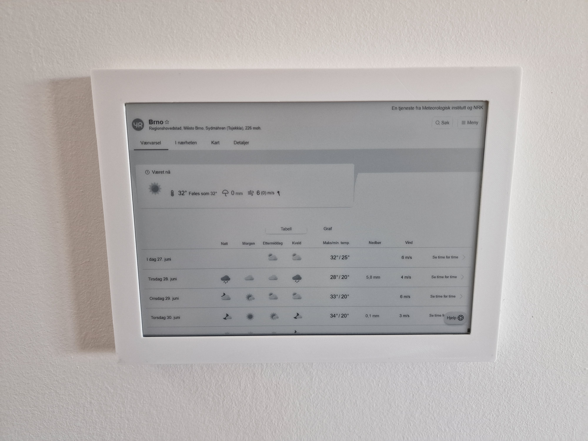
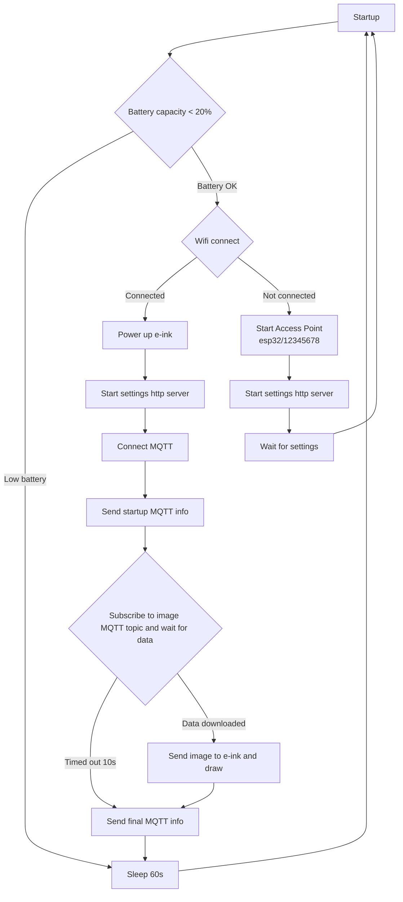
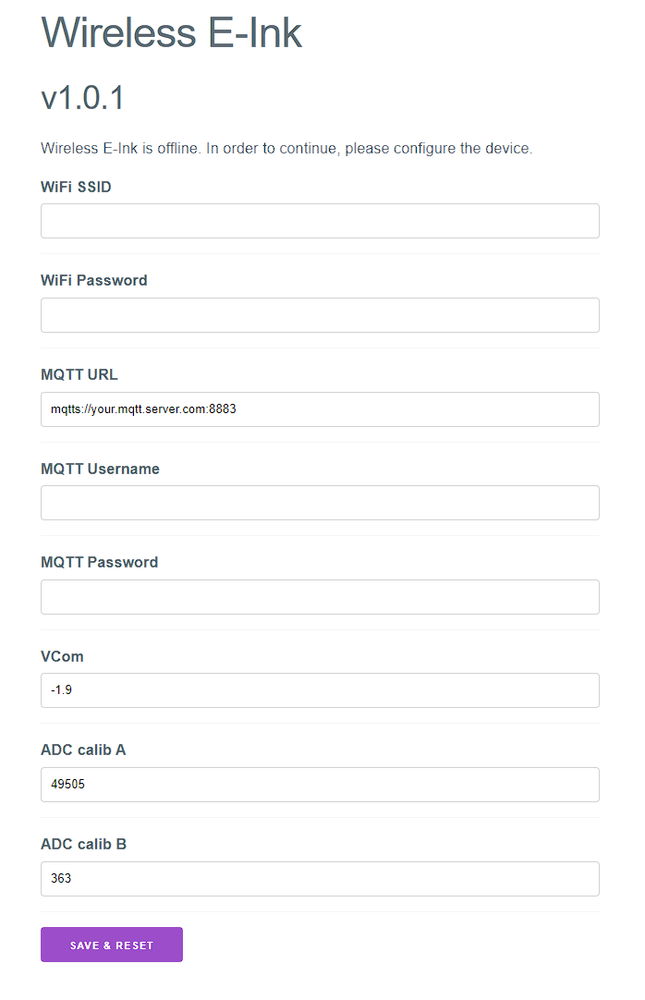
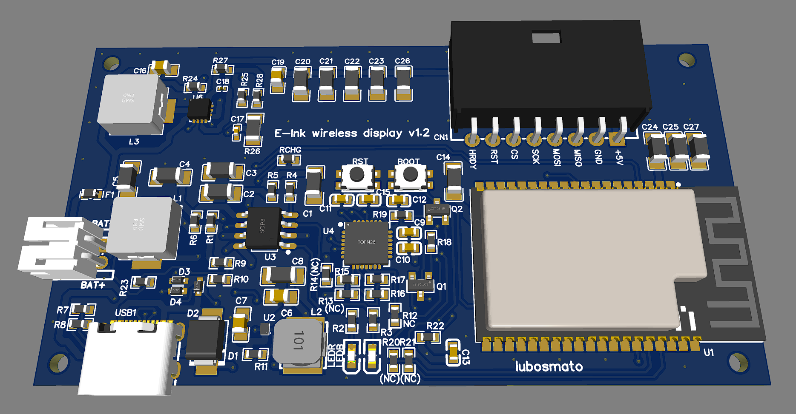
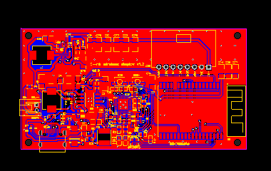
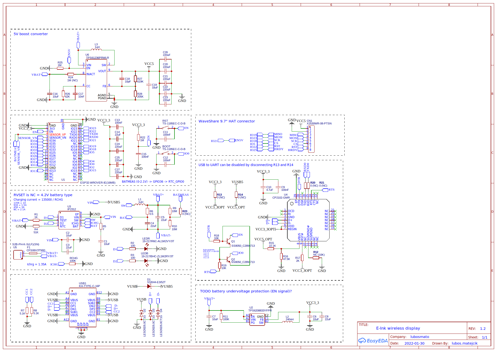
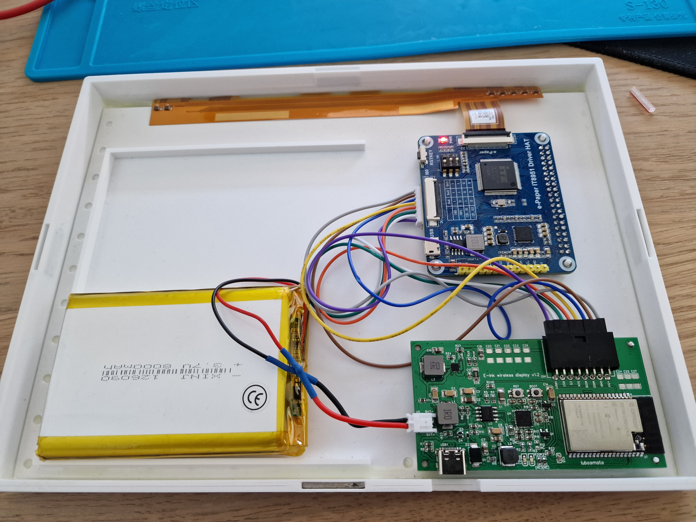

# E-Ink wireless display

Battery powered E-Ink WiFi (MQTT) Display with ESP32 WROVER. 145 days without charging*. 

# MQTT topics (API)

Topics prefix: `esp32/#ID#/`. Eg: `esp32/123456/info/startup/rssi`.

`#ID#` = unique device identifier (last 3 bytes of MAC in hex)

Published data are published with QOS0 without retained flag (non-retained). 

## Input topics
- `image`: data bytes of PNG image to draw on display. Size has to match display's resolution (1200×825). Must be published as **retained**. TIP: Use imagemin with PNG quant to get the smallest size to use less power. 
- `ping`: received data is published on topic `pong`. Dev purpose.

## Output topics
- `info/timedOut`: true if image was not downloaded in timeout (10s)
- `info/finish/freeHeap`: free heap before sleep of ESP32 in bytes
- `info/finish/totalHeap`: total heap before sleep of ESP32 in bytes
- `info/finish/totalTime`: (total) elapsed time before going to sleep
- `info/startup/rssi`: [RSSI](https://en.wikipedia.org/wiki/Received_signal_strength_indication) of connected WiFi
- `info/startup/freeHeap`: free heap on startup of ESP32 in bytes
- `info/startup/totalHeap`: total heap on startup of ESP32 in bytes
- `info/startup/time`: elapsed time before MQTT is connected in microseconds
- `info/startup/batteryRaw`: raw ADC readings (without calibration) of battery voltage. Useful for ADC calibration
- `info/startup/batteryVoltage`: calibrated battery voltage in volts
- `info/startup/batteryCapacity`: battery capacity
- `pong`: answer to ping

## Device workflow

# Settings server

When unable to connect to WiFi settings server is started and waited for user to configure the display (WiFi, MQTT URL and credentials, ...)

VCom is voltage for e-ink display that adjusts contrast.

ADC calib A and B are coefficients for ADC calibration for battery voltage (capacity) measurement. Formula is `calibrated_voltage [mV] = adc_sample * A + B`.

\*10s code execution (100mA) and 600s sleep time (200µA) on 8000mAh battery with 20% discharge safety

# Hardware

https://oshwlab.com/lubos.matejcik/esp32-wrover-battery-module_copy_copy

Drawn in easyeda.com.

# Enclosure

Consists of three parts:

1. Wall mounted holder
2. Display holder/spacer
3. Cover

Display and boards are glued to display holder/space and cover is glued to display holder. 

Whole enclosure is held by thin magnets inserted and glued into parts. This allows easy disassembly for recharing.

## Display holder/spacer with cover and electronics

## Wall mounted holder

