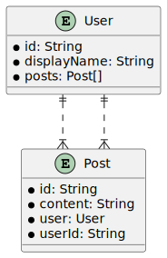

# E-ink backend


## How to dev

Set env `DATABASE_URL` in `.env` and:

```bash
yarn install # postinstall will generate prisma stuff
yarn prisma:migrate
yarn dev
```

## Database model (auto generated)


